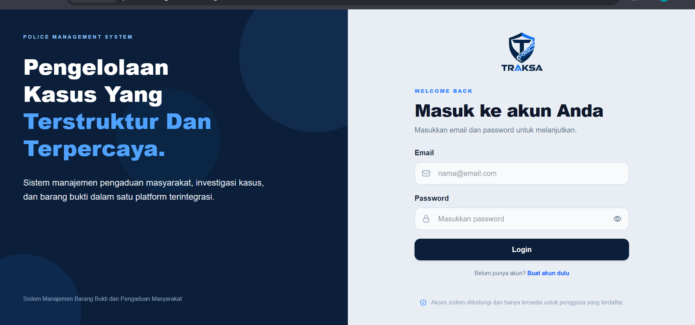
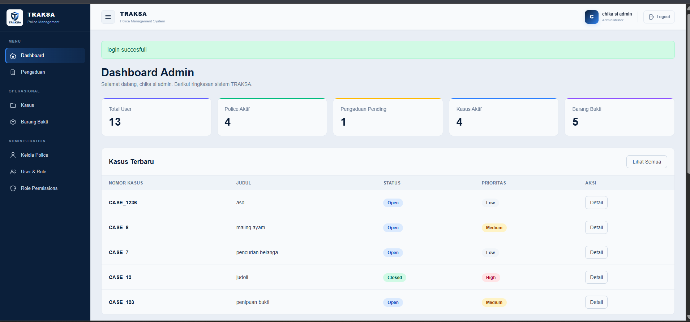
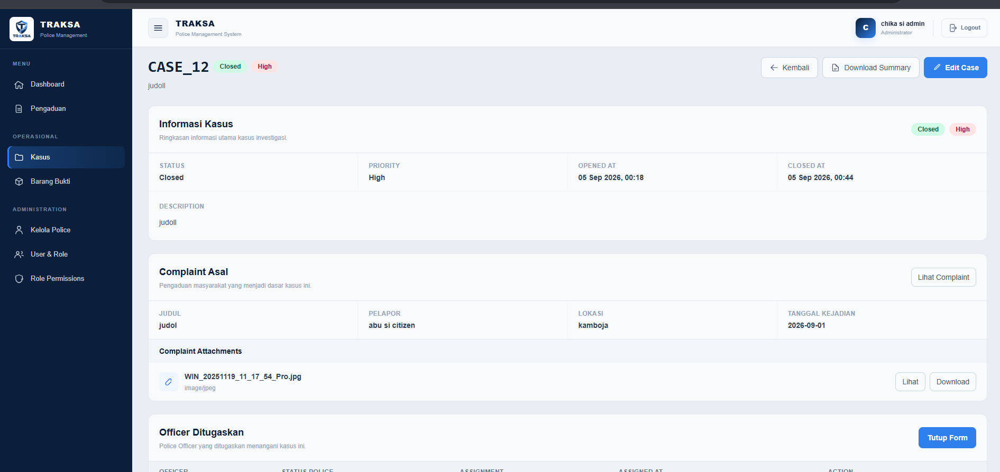
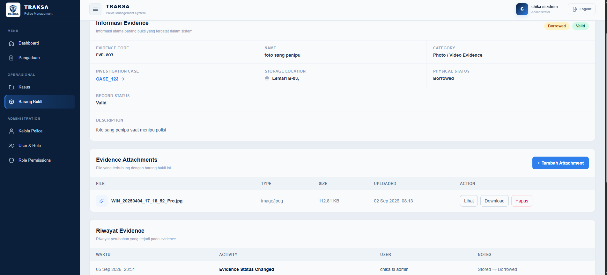

<div align="center">


# TRAKSA

### Police Management System

A web-based information system for managing citizen complaints, investigation cases, police officers, suspects, evidence, and role-based access control.

<br>


</div>

---

## About TRAKSA

**TRAKSA** is a web-based Police Management System designed to support the management of citizen complaints and investigation processes.

The system provides a structured workflow from the initial submission of a citizen complaint, police review, conversion into an investigation case, officer assignment, suspect management, evidence management, and investigation history tracking.

TRAKSA also implements role and permission-based access control to ensure that each user can only access and perform actions according to their responsibility within the system.

---

## Main Features

### Citizen Complaint Management

- Citizen registration and authentication
- Create and manage complaints
- Upload complaint attachments
- Submit complaints for police review
- Request additional evidence
- Complaint rejection
- Complaint status tracking

Complaint lifecycle:

```text
Draft
  ↓
Pending
  ├──→ Need More Evidence
  │        ↓
  │     Pending
  │
  ├──→ Rejected
  │
  └──→ Approved → Investigation Case
```

### Investigation Case Management

- Convert approved complaints into investigation cases
- Case number and priority management
- Case status management
- Assign police officers to investigation cases
- Activate or deactivate officer assignments
- Track investigation case history
- Generate downloadable case summary PDF

Case statuses:

```text
Open
In Progress
Closed
```

### Police Officer Management

- Manage registered Police Officers
- Assign rank and unit
- Store NRP and officer information
- Activate or deactivate Police Officers
- Assign officers to investigation cases
- View officer profiles

### Suspect Management

- Register suspects within investigation cases
- Update suspect information
- Track suspect status
- Store identity number, address, and investigation notes

Supported statuses:

```text
Identified
Wanted
Detained
Released
```

### Evidence Management

- Register evidence for an investigation case
- Categorize evidence
- Track storage location
- Update physical evidence status
- Upload multiple evidence attachments
- View and download evidence attachments
- Automatically record evidence history
- Void invalid evidence records

Physical evidence statuses:

```text
Stored
Borrowed
Returned
Destroyed
```

Record statuses:

```text
Valid
Voided
```

A **Voided** evidence record is preserved for audit purposes and cannot be edited again.

### Role & Permission Management

TRAKSA implements Role-Based Access Control (RBAC).

Administrators can:

- View users and their roles
- Assign roles to users
- Manage permissions for each role
- Manage Police Officer accounts

The primary roles used by the system are:

| Role | Responsibility |
| --- | --- |
| `citizen` | Submit and manage personal complaints |
| `police` | Review complaints and perform investigation operations |
| `investigation_supervisor` | Assign Police Officers to investigation cases |
| `admin` | System administration and unrestricted operational management |

---

## Authorization

TRAKSA uses both **permission-based authorization** and **case assignment restrictions**.

Police Officers may have permission to update investigation resources, but mutation actions inside an investigation case are only allowed when the officer has an **Active assignment** to that case.

Administrators can bypass officer assignment restrictions when they have the appropriate permission.

Examples of protected actions include:

```text
Case Update
Evidence Create / Update
Evidence Attachment Management
Suspect Create / Update
```

This prevents Police Officers from modifying investigation data from cases they are not assigned to.

---

## Dashboard

TRAKSA provides different dashboards based on the authenticated user's role.

### Citizen Dashboard

Displays:

- Total complaints
- Pending complaints
- Complaints requiring additional evidence
- Approved complaints
- Rejected complaints
- Recent complaints

### Police Dashboard

Displays:

- Assigned active cases
- Evidence statistics
- Pending complaints
- Cases closed during the current month
- Recent assigned cases

### Administrator Dashboard

Displays:

- Total users
- Active Police Officers
- Pending complaints
- Active investigation cases
- Evidence statistics
- Recent cases
- Administration shortcuts

---

## User Interface

TRAKSA includes a responsive administrative interface designed for desktop and mobile usage.

The interface includes:

- Responsive authentication pages
- TRAKSA branding
- Collapsible desktop sidebar
- Mobile sidebar overlay
- Responsive navigation bar
- Role-aware navigation
- Status and priority indicators
- Responsive tables
- Collapsible operational forms
- Evidence danger-zone actions
- Responsive footer
- Mobile-friendly layouts

---

## Tech Stack

| Technology | Usage |
| --- | --- |
| Laravel 13 | Backend framework |
| PHP 8.4 | Server-side language |
| Blade | Server-side templating |
| Tailwind CSS v4 | User interface styling |
| Vite | Frontend asset bundling |
| Vanilla JavaScript | Interactive UI behavior |
| MySQL | Relational database |
| Eloquent ORM | Database abstraction |
| DomPDF | Case Summary PDF generation |

---

## Installation

### 1. Clone Repository

```bash
git clone https://github.com/juliotanlain20-netizen/police-management.git
```

```bash
cd police-management
```

### 2. Install PHP Dependencies

```bash
composer install
```

### 3. Install Frontend Dependencies

```bash
npm install
```

### 4. Environment Configuration

Copy the environment file:

```bash
cp .env.example .env
```

For Windows PowerShell:

```powershell
Copy-Item .env.example .env
```

Generate the application key:

```bash
php artisan key:generate
```

### 5. Configure Database

Update the database configuration inside `.env`.

Example:

```env
DB_CONNECTION=mysql
DB_HOST=127.0.0.1
DB_PORT=3306
DB_DATABASE=police_management
DB_USERNAME=root
DB_PASSWORD=
```

### 6. Run Database Migration

```bash
php artisan migrate --seed
```

### 7. Build Frontend Assets

For development:

```bash
npm run dev
```

For production:

```bash
npm run build
```

### 8. Run Application

```bash
php artisan serve
```

Then open:

```text
http://127.0.0.1:8000
```

If using Laravel Herd, the application can also be accessed through the configured Herd domain.

---

## Project Structure

```text
app/
├── Http/
│   ├── Controllers/
│   ├── Middleware/
│   └── Requests/
│
├── Models/
│
resources/
├── css/
│   └── app.css
├── js/
│   └── app.js
└── views/
    ├── admin/
    ├── auth/
    ├── cases/
    ├── complaint/
    ├── dashboard/
    ├── evidences/
    ├── layouts/
    ├── partials/
    ├── police/
    └── suspect/
│
database/
├── factories/
├── migrations/
└── seeders/
│
routes/
└── web.php
```

---

## Core Data Flow

```text
Citizen
   │
   ▼
Complaint
   │
   ▼
Police Review
   │
   ├───────────────┐
   │               │
   ▼               ▼
Rejected     Need More Evidence
                   │
                   ▼
                Pending
                   │
                   ▼
                Approved
                   │
                   ▼
          Investigation Case
                   │
         ┌─────────┼─────────┐
         ▼         ▼         ▼
      Officers  Suspects  Evidence
                             │
                             ▼
                       Attachments
```

---
## Screenshots

### Authentication



### Administrator Dashboard



### Investigation Case



### Evidence Management



> Create a `docs/screenshots` directory and place the screenshots there before enabling the image links above.

---

## Security

TRAKSA implements several application-level security mechanisms, including:

- Laravel authentication
- CSRF protection
- Permission middleware
- Role-based authorization
- Active Police Officer validation
- Investigation case assignment validation
- Server-side request validation
- Private attachment access through application routes

---

## Author

**Julio Tan**

Informatics / Computer Science  
Telkom University Surabaya

GitHub: [juliotanlain20-netizen](https://github.com/juliotanlain20-netizen)

---

## License

This project is licensed under the [MIT License](https://opensource.org/licenses/MIT).

---

<div align="center">

**TRAKSA — Police Management System**

Sistem Manajemen Barang Bukti dan Pengaduan Masyarakat

</div>